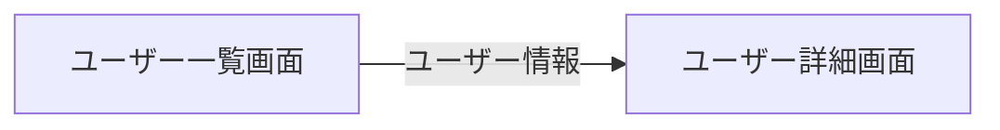

# インスタンス生成時にパラメータを渡すには

## 概要
インスタンス生成のたびにコンストラクタ引数に異なる値を渡したいケースがある。
しかし、ServiceProvider には該当する機能がない。  
本稿では、上記のケースの対応方法について記載する。

## 課題  
例えば、ユーザー一覧画面とユーザー詳細画面のある MVVM で実装されたアプリケーションで、ユーザー一覧画面からユーザー詳細画面に表示したいユーザー情報を渡す場合、ユーザー詳細画面の ViewModel のコンストラクタ引数でユーザー情報を受け取ることが考えられる。  
しかし、ServiceProvider には UnityContainer にあった一部のコンストラクタ引数をインスタンス生成時に指定する機能がないため、ユーザー情報を渡すことができない。

※都度 ServiceCollection に登録して ServiceProvider を作り直す方法はオーバーヘッドが大きいと思われるため選択肢から除外している。またその方法でも同じ型のコンストラクタ引数が複数あった場合解決することができない。  

※ユーザー情報をコンストラクタ引数ではなく、プロパティやメソッドで受け取る方法も考えられるが、ユーザー情報が必須であることが明確でなくなるため選択肢から除外している。



```cs
// ユーザー詳細画面のViewModel
class UserDetailsViewModel
{
    // ↓コンストラクタ引数でユーザー情報を受け取りたい
    public UserDetailsViewModel(User user)
    {
        ...
    }
}
```

```cs
// インスタンス生成時にコンストラクタ引数を渡す手段が無いのでユーザー情報が渡せない
var vm = provider.GetRequiredService<UserDetailsViewModel>();
```

## 対応
対象のクラスを生成する Factory クラスを作成し、ServiceCollection には Factory クラスを登録する。  
対象のクラスのインスタンスを生成する際は、まず Factory クラスを取得し、取得した Factory クラスで対象のインスタンスを生成する。

```cs
// ユーザー詳細情報ViewModelを生成するFactoryクラス
class UserDetailsViewModelFactory
{
    // ユーザー詳細情報ViewModelを
    UserDetailsViewModel CreateInstance(User user)
    {
        return new UserDetailsViewModel(user);
    }
}
```

```cs
// ServiceProviderからはFactoryを取得し、取得したFactoryで対象のクラスを生成する
var vm = provider.GetRequiredService<UserDetailsViewModelFactory>()
    .CreateInstance(user);
```
